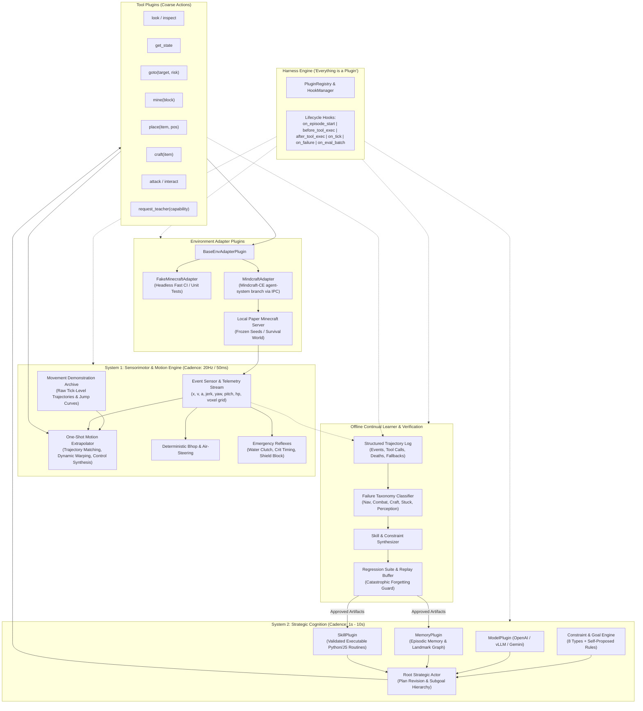
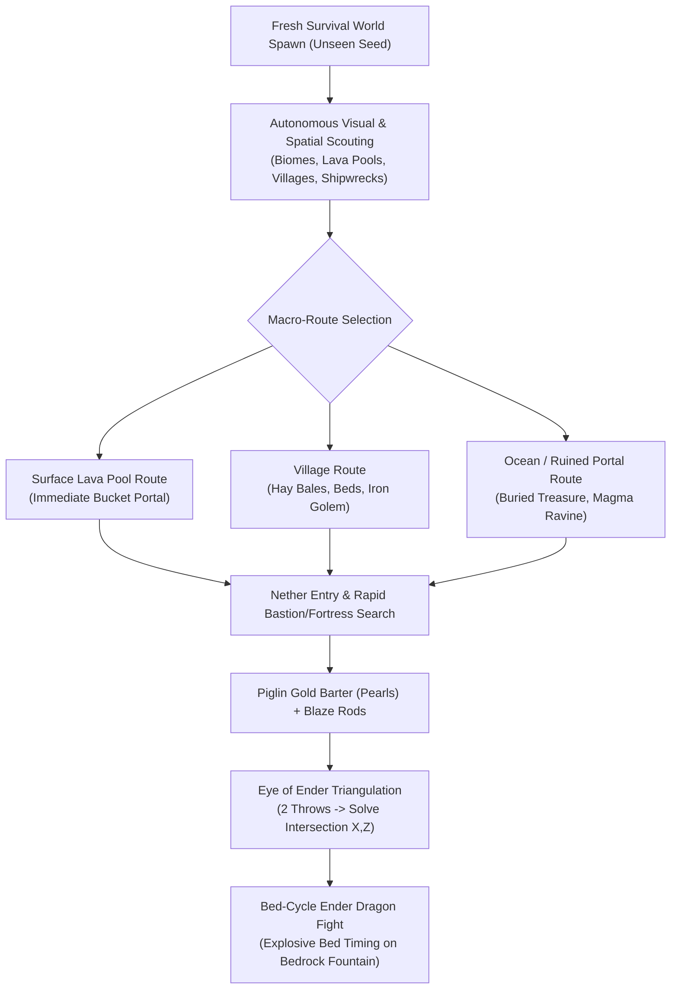

# Prime-Craft: Emergent Continual-Learning Agent Harness
## Architectural Plan & Build-Out Specification (Plugin Harness, Agent-System Branch & Motion Extrapolation)

## Overview & Core Principles
Prime-Craft is a minimal, model-agnostic continual-learning agent system where an agent learns to pursue long-horizon survival goals through embodied interaction, reflective memory, reusable skill synthesis, and declining teacher scaffolding. Minecraft is the primary testbed, with autonomous Ender Dragon defeat on unseen seeds as an integration benchmark.

Following the project directives:
1. **No Hard-Coded Gameplay Scripts**: The system encodes no Minecraft progression tree, tech tree, Nether plan, or dragon script. Emergence must be genuine: unencoded, useful, persistent, and transferable.
2. **References as References Only**: We do not port entire third-party frameworks. We extract the architectural essence:
   - **DeepSeek-Harness**: The **"Everything is a Plugin"** decoupled harness pattern (models, tools, memory, adapters, evaluators, and teachers are plugins interacting through lifecycle hooks).
   - **Mindcraft-CE (`agent-system` branch)**: The primary experimental Minecraft host, leveraging its function-calling and tool-centric agent abstractions rather than text-command soup.
   - **Voyager**: Reusable executable skill library with iterative error reflection and sandboxed verification.
   - **Prime-Agent**: Persistent computational state, outer learner vs. inner actor split, versioned artifact storage, and checkpoint rollbacks.
   - **Gen-1.5 / Physical Generalization**: High-frequency telemetry logging, demonstration replay, and one-shot motion extrapolation.
3. **Dual-Process Integration (System 1 AND System 2)**:
   - **System 1 (Kinematic Reflex & Motion Extrapolator)**: High-frequency (20Hz / 50ms) event-sensor stream tracking $(x, y, z)$, $(v_x, v_y, v_z)$, $(a_x, a_y, a_z)$, jerk, yaw, pitch, collision, and local voxels. Includes one-shot motion extrapolation from recorded demonstrations, deterministic bhop, and emergency reflexes (e.g. water bucket clutch, critical hit timing).
   - **System 2 (Strategic Cognition & Deliberation)**: Low-frequency (1s–10s) LLM actor managing goal decomposition, milestone tracking, active constraint adherence, tool execution, and teacher fallback requests.
4. **Continual Learning via Teacher Fallbacks**: Student attempts tasks first. On failure or uncertainty, teachers intervene; interventions are logged, reflected upon by the offline Outer Learner, and distilled into skills and constraints. Success on unseen seeds must rise while teacher fallback usage declines.

---

## User Review Required

> [!IMPORTANT]
> **Mindcraft-CE Integration Target**: We are targeting the **`agent-system`** branch of Mindcraft-CE. This branch restructures the Mineflayer client around structured tool calling and modular agent primitives. The Python harness interacts with this runtime via a clean IPC/WebSocket bridge (`MindcraftAdapterPlugin`).

> [!IMPORTANT]
> **Demonstration & Motion Extrapolation Engine**: Dedicated **Movement Replay & Extrapolation Engine** (`harness/locomotion/extrapolator.py`). It records tick-level in-game kinematics ($x, v, a, \theta, \phi$) from human or expert bot runs and performs one-shot motion extrapolation (adapting demonstrated jump curves, air-strafing, and landing recoveries to novel terrain geometries).

---

## Open Questions

> [!NOTE]
> **Demonstration Sourcing for One-Shot Motion**: For the initial movement demonstration library, should we bundle a collection of scripted expert trajectories (e.g., 2-block, 3-block, 4-block sprint jumps, ravine descents, water clutches) recorded via Mineflayer, or provide a recording tool for human gameplay via a Minecraft client proxy? *(The plan implements both: a headless recorder CLI and an initial seed bank of synthetic trajectories)*.

> [!NOTE]
> **LLM Provider Default**: The `ModelPlugin` defaults to an OpenAI-compatible HTTP interface (supporting OpenAI, OpenRouter, vLLM, and Ollama out of the box). Native Gemini and Anthropic plugins can be enabled via configuration.

---

## System Architecture



---

## Detailed Component Specifications

### 1. "Everything is a Plugin" Harness Core
Inspired by DeepSeek-Harness, all subsystems inherit from a unified `Plugin` base class. This enforces complete decoupling and isolation:
- `PluginRegistry`: Discovers, registers, configures, and instantiates plugins from YAML definitions.
- `HookManager`: Broadcasts events across plugins without tight coupling:
  - `on_session_start`, `on_episode_start(seed, goal, constraints)`
  - `on_tick(sensor_state)` (System 1 loop)
  - `before_tool_exec(tool_name, args)`, `after_tool_exec(tool_name, result, duration)`
  - `on_teacher_invoked(capability, reason)`
  - `on_failure(failure_type, context)`
  - `on_episode_end(trajectory, metrics)`, `on_eval_batch_end(eval_report)`

### 2. Mindcraft-CE `agent-system` Branch Adapter
- Interacts with the `agent-system` branch of Mindcraft-CE.
- Replaces legacy chat-command interfaces with direct RPC over WebSocket/IPC.
- Exposes Mineflayer primitives as clean typed actions.
- Features:
  - Asynchronous event push (health changes, chat, entity detection, block updates).
  - Synchronous tool invocation (`goto`, `mine`, `craft`, `place`, `attack`).
  - High-frequency kinematics stream emission (20Hz) to feed System 1.

### 3. System 1: Raw Telemetry Replay & One-Shot Motion Extrapolation
This addresses taking raw in-game data, logging it, and extrapolating motion from demonstrations:
- **Tick-Level Telemetry Schema**:
  - Kinematics: Position $(x,y,z)$, velocity $(v_x,v_y,v_z)$, acceleration $(a_x,a_y,a_z)$, jerk $(j_x,j_y,j_z)$, yaw $\theta$, pitch $\phi$.
  - Dynamics: `on_ground`, `in_water`, `is_sprinting`, `is_sneaking`, `is_jumping`, `collided_horizontally`, `collided_vertically`.
  - Local Geometry: $3 \times 3 \times 3$ voxel bounding box relative to player eye position.
- **Demonstration Recorder (`harness/locomotion/recorder.py`)**:
  - Captures high-rate telemetry into compressed demonstration files (`.mcrun.jsonl`).
  - Tags segments with intent (e.g. `sprint_jump_4_block`, `water_clutch_high_fall`, `ravine_descent`, `pillar_up`).
- **Motion Extrapolator (`harness/locomotion/extrapolator.py`)**:
  - Given the agent's current state $S_0$ and a local target waypoint $W$:
    1. **Exemplar Retrieval**: Matches the closest demonstration by initial velocity vector, clearance height, and target delta $(\Delta x, \Delta y, \Delta z)$.
    2. **Kinematic Extrapolation**: Uses Dynamic Time Warping (DTW) and trajectory warping / spline projection to stretch, scale, and adjust the yaw/pitch and sprint-jump timing to match the novel terrain geometry.
    3. **Closed-Loop Execution & Drift Correction**: Evaluates trajectory progress at 20Hz. If dynamic error exceeds safety bounds, aborts to System 1 safety reflexes (e.g., sneak edge-stop, emergency water clutch) and invokes teacher fallback.

### 4. System 2: Strategic Cognition & Continual Outer Learner
- **Strategic Actor (`harness/actor.py`)**: Provider-agnostic LLM caller. Formulates high-level subgoals, selects tools, checks progress, and monitors invariants.
- **Constraint Engine (`harness/constraints.py`)**: Enforces 8 constraint types: `resource`, `safety`, `action`, `ordering`, `spatial`, `invariant`, `conditional`, `preference`.
- **Outer Learner (`harness/learner.py`)**:
  - Runs offline after single episodes or frozen evaluation batches.
  - Classifies failures using `FailureTaxonomy` (`navigation`, `combat`, `crafting`, `resource_search`, `stuck`, `interface_error`).
  - Generates versioned Python/Mineflayer skills (Voyager-style), verifiable in a sandbox.
  - Generates self-proposed constraints from failure patterns (e.g., "before Nether entry, require minimum 10 obsidian, flint & steel, and 32 food").
- **Regression Guard (`harness/replay.py`)**: Runs regression checks over past task sets before committing new skills/memories to prevent catastrophic forgetting.

---

## Directory Structure (Phase 1 Target)

```
prime-craft/
├── README.md                          # Quickstart, plugin system, fake vs real env
├── AGENTS.md                          # Operating conventions & developer guide
├── pyproject.toml                     # Poetry/pip build configuration
├── configs/
│   ├── harness.yaml                   # Core plugin registry configuration
│   ├── providers.yaml                 # Model endpoints (OpenAI-compatible, local, etc.)
│   ├── goals/
│   │   ├── session1_goals.yaml        # Harvest wood, craft pickaxe, collect stone
│   │   └── synthetic_goals.yaml      # Constrained multi-objective goals
│   └── eval/
│       └── seeds.yaml                 # Development, validation, held-out seeds
├── harness/
│   ├── __init__.py
│   ├── core/                          # DeepSeek-inspired plugin harness core
│   │   ├── __init__.py
│   │   ├── plugin.py                  # Plugin base class & metadata
│   │   ├── registry.py                # PluginRegistry (discovery & instantiation)
│   │   └── hooks.py                   # HookManager & lifecycle dispatch
│   ├── actor.py                       # System 2 LLM strategic actor
│   ├── constraints.py                 # Multi-attribute constraint evaluator
│   ├── failure_taxonomy.py            # Automated failure categorizer
│   ├── learner.py                     # Outer loop continual learner & synthesizer
│   ├── loop.py                        # Execution loop & trajectory streaming
│   ├── memory.py                      # Persistent episodic memory & landmark store
│   ├── metrics.py                     # KPI tracking (teacher calls, tokens, time)
│   ├── replay.py                      # Replay buffer & regression test runner
│   ├── skills.py                      # Versioned procedural skill repository
│   └── tools.py                       # ToolPlugin definitions & schema generator
├── locomotion/                        # System 1 sensorimotor & motion engine
│   ├── __init__.py
│   ├── sensor_stream.py               # 20Hz kinematic & voxel telemetry aggregator
│   ├── recorder.py                    # Demonstration recorder for raw telemetry
│   ├── extrapolator.py                # One-shot motion extrapolator (exemplar matching)
│   ├── bhop.py                        # Deterministic bunny-hop & air-steering
│   └── reflexes.py                    # Water clutch, crit timing, shield block
├── adapters/                          # Environment adapter plugins
│   ├── __init__.py
│   ├── base.py                        # BaseEnvAdapterPlugin interface
│   ├── fake_minecraft.py              # Mock headless Minecraft simulator
│   └── mindcraft.py                   # Mindcraft-CE agent-system bridge client
├── bridge/                            # Node.js Mineflayer bridge (agent-system branch)
│   ├── package.json
│   ├── bot.js                         # Mineflayer bot connection & IPC server
│   ├── telemetry.js                   # 20Hz raw state emitter
│   └── pathfinder.js                  # Waypoint navigation & execution
├── eval/
│   ├── __init__.py
│   ├── runner.py                      # Frozen-seed batch evaluation runner
│   └── report.py                      # Benchmark summary & JSON trace generator
├── traces/                            # Output trajectory logs (JSONL, gitignored)
├── demos/                             # Recorded movement demonstrations (.mcrun.jsonl)
└── tests/
    ├── __init__.py
    ├── test_plugins.py                # Plugin registration & hook lifecycle tests
    ├── test_constraints.py            # 8 constraint types verification
    ├── test_fake_env.py               # Deterministic FakeMinecraft tests
    ├── test_motion_extrapolator.py    # One-shot telemetry replay & warping tests
    └── test_integration.py           # End-to-end actor loop on FakeMinecraft
```

---

## Phased Build-Out Roadmap

### Phase 1: Plugin Harness, Fast Loop & Motion Extrapolation (Devin Session 1 Scope)
- Implement `harness/core/` ("Everything is a Plugin" registry + lifecycle hooks).
- Implement `FakeMinecraftAdapter` with 3D coordinate space, block mining, and crafting.
- Implement System 2 Actor with OpenAI-compatible tool calling.
- Implement System 1 Telemetry Recorder & basic `MotionExtrapolator` with synthetic jump trajectories.
- Implement Constraint engine, Teacher fallback counter, and Trajectory logger.
- Implement Frozen Evaluation Runner (`eval/runner.py`).
- Complete automated unit and integration tests passing on FakeMinecraft.

### Phase 2: Mindcraft-CE `agent-system` Branch Integration (Session 2)
- Wire Node.js Mineflayer client targeting the `agent-system` branch of Mindcraft-CE.
- Implement 20Hz raw telemetry streaming over WebSocket/IPC into Python `SensorStream`.
- Map coarse tools (`goto`, `mine`, `place`, `craft`, `attack`) to Mindcraft-CE actions.
- Deploy local Paper MC server with seed automation.
- Run Phase 0 Oracle baseline to verify full execution plumbing.

### Phase 3: Outer Learner & Continual Skill Synthesis (Session 3)
- Implement full `OuterLearner` analyzing trajectory traces and teacher interventions.
- Implement Voyager-style executable skill synthesis with sandboxed Python/Mineflayer verification.
- Implement self-proposed constraint generation from failure patterns.
- Implement `RegressionGuard` running historical task suites before committing new skills.

### Phase 4: Full System 1 Sensorimotor & Tactical Reflexes (Session 4 & 6)
- Record comprehensive movement demonstrations (sprint-jumping, parkour gaps, pillar jumping, water clutching).
- Train/calibrate `MotionExtrapolator` with Dynamic Time Warping and geometry-adapted trajectory scaling.
- Integrate deterministic bhop controller with safety gates.
- Implement emergency tactical reflexes (instant water bucket clutch, projectile shield block, crit timing).

### Phase 5: Benchmark Ladder, Generalization & Dragon Protocol (Session 5 & 7)
- Run progression: Known seeds $\to$ Unseen seeds $\to$ Synthetic constrained goals $\to$ Full Ender Dragon run.
- Enforce strict benchmark constraints (fresh random seed, zero operator commands, zero human help).
- Measure the **Dependency Decline Curve** ($\text{Teacher Calls} \downarrow$ alongside $\text{Success Rate} \uparrow$).

### Phase 6: Cross-Domain Learning Transfer (Session 8)
- Implement an adapter for a discrete factory or robotics simulation.
- Verify that the outer learning harness accelerates learning in the novel domain without domain-specific alterations.

---

## Verification & Validation Plan

### Automated Test Suite
1. **Plugin Lifecycle Test (`test_plugins.py`)**:
   - Verify plugin loading from YAML, dependency resolution, and hook invocation ordering (`on_episode_start` $\to$ `before_tool_exec` $\to$ `after_tool_exec` $\to$ `on_episode_end`).
2. **One-Shot Motion Extrapolator Test (`test_motion_extrapolator.py`)**:
   - Load a recorded 3-block sprint-jump demonstration.
   - Request extrapolation to a novel 3.5-block gap at a $15^\circ$ diagonal offset.
   - Verify generated kinematic waypoint trajectory matches physical feasibility bounds (velocity, jump impulse, gravity).
3. **Constraint Evaluator Test (`test_constraints.py`)**:
   - Test violations across invariant, safety, resource, spatial, and ordering conditions.
4. **Deterministic FakeMinecraft End-to-End Test (`test_integration.py`)**:
   - Run mocked LLM actor on `collect_wood` and `craft_wooden_pickaxe`.
   - Verify trajectory log format, metric counters, and fallback tracking.
5. **Frozen Evaluation Runner CLI**:
   - Run `python -m eval.runner --goal collect_wood --seeds 3 --actor-version v0 --fake-env`. Verify output `traces/eval-<timestamp>.json`.

---

## Extension: Autonomous Speedrunning & Universal Advancement Generalization

This appended extension builds directly on top of the completed harness foundation to enable **zero-human-input speedrunning** and **universal advancement unlocking**.

### 1. The Universal Advancement Generalization Engine
Advancements in Minecraft are formal JSON event criteria published by Mojang. Instead of hand-coding recipes for advancements, the harness treats advancements as declarative predicates matched by the System 1 event sensor:
- `AdvancementCriteriaParser`: Reads Mojang JSON definitions (`minecraft:inventory_changed`, `minecraft:player_killed_entity`, `minecraft:location`, `minecraft:effects_changed`, etc.).
- `InverseGoalDecomposer`: When given **any** target advancement (vanilla, custom, or held-out):
  1. Identifies the target event trigger $E_{\text{adv}}$ and its required conditions.
  2. Generates a prerequisite subgoal tree (what items, tools, mobs, or structures are required).
  3. Executes the sequence dynamically using the learned skill library without custom hard-coded scripts.
- **Advancement Generalization Suite**: Evaluates the agent on a held-out set of obscure achievements (e.g. *Two Birds One Arrow*, *A Furious Cocktail*, *Uneasy Alliance*, *Cover Me In Debris*) to measure true compositional zero-shot generalization.

### 2. Autonomous Zero-Input Speedrun Engine
A capable enough foundation model (or a distilled System 2 + System 1 policy) can execute a complete survival run in **Speedrun Mode** with zero human prompts, zero operator cheats, and zero assistance.



#### Speedrun Capabilities & Macro-Mechanics:
- **Dynamic Objective Optimization**:
  $$\min \text{Time} \quad \text{subject to} \quad P(\text{completion}) \ge \alpha_{\text{threshold}}$$
  Safety tasks are pruned: diamond armor mining is replaced by rapid iron gear and water buckets; food harvesting is replaced by hay bale crafting.
- **Bucket-and-Lava Nether Portal (`speedrun/portal_builder.py`)**:
  Builds a functional Nether portal in under 30 seconds using 1 water bucket, 10 surface lava source blocks, and 4 cobblestone blocks, avoiding the need for diamond pickaxe obsidian mining.
- **Bastion Bartering Loop**:
  Rapidly trades gathered gold with Piglins to secure 12+ Ender Pearls and Fire Resistance potions, avoiding the slow manual Enderman hunting process.
- **Eye of Ender Triangulation (`speedrun/triangulation.py`)**:
  Throws two Eyes of Ender from separated coordinates $(\mathbf{p}_1, \mathbf{p}_2)$ and measures raycast flight angles $(\theta_1, \theta_2)$. Algebraically computes the ray intersection to pinpoint the Stronghold coordinates $(X_{\text{stronghold}}, Z_{\text{stronghold}})$ without manual path wandering.
- **Bed-Cycling Dragon Combat (`speedrun/combat_tactics.py`)**:
  Takes advantage of the Minecraft mechanic where sleeping in the End causes beds to explode. When the dragon descends to the central bedrock fountain, the bot places beds at dragon-head level behind an obsidian or cobblestone blast shield, detonating beds in rapid sequence to defeat the Ender Dragon in under 60 seconds.
- **Zero-Input Autonomy**:
  The entire speedrun sequence runs end-to-end: world spawn $\to$ autonomous seed scouting $\to$ route selection $\to$ Nether entry $\to$ triangulation $\to$ bed cycle kill, without a single human intervention.
