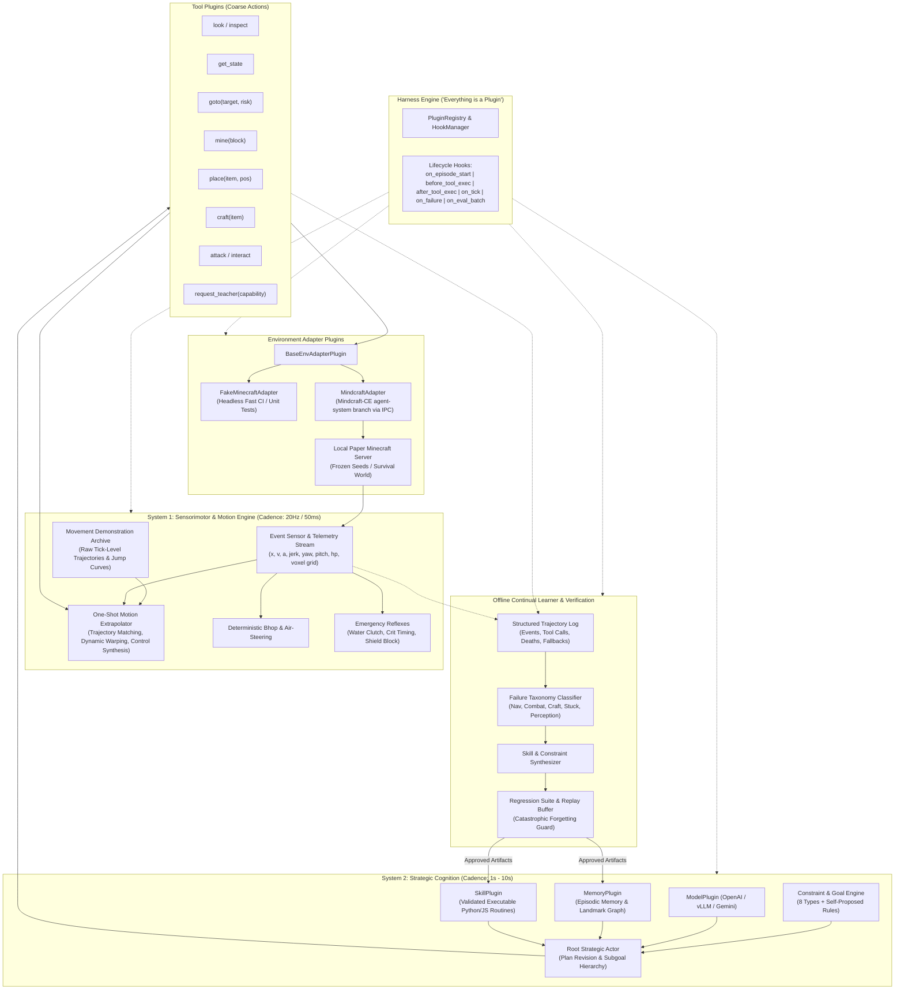
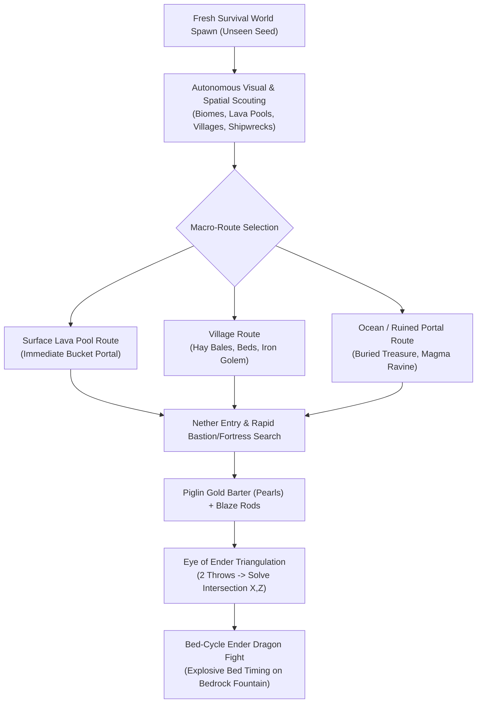

# Prime-Craft: Emergent Continual-Learning Agent Harness
## Architectural Plan & Build-Out Specification (Plugin Harness, Agent-System Branch & Motion Extrapolation)

## Overview & Core Principles
Prime-Craft is a model-agnostic continual-learning agent for long-horizon survival. Minecraft is its primary testbed, and autonomous Ender Dragon defeat on unseen seeds is the integration benchmark.

The system encodes no Minecraft progression tree, tech tree, Nether plan, or dragon script. Useful behavior must emerge without being encoded, persist, and transfer. It borrows specific ideas rather than porting whole frameworks: DeepSeek-Harness's plugin lifecycle; Mindcraft-CE `agent-system` function calling and tool abstractions; Voyager's executable skill library, error reflection, and sandboxed verification; Prime-Agent's persistent state, outer learner and inner actor split, versioned artifacts, and checkpoint rollback; and Gen-1.5's high-frequency telemetry, demonstration replay, and one-shot motion extrapolation.
The two runtime loops divide work by cadence:

- System 1 runs at 20Hz / 50ms. Its event sensor tracks $(x, y, z)$, $(v_x, v_y, v_z)$, $(a_x, a_y, a_z)$, jerk, yaw, pitch, collisions, and local voxels for motion extrapolation, deterministic bhop, and emergency reflexes such as water bucket clutch and critical-hit timing.
- System 2 is a 1s–10s LLM actor for goal decomposition, milestones, constraints, tool execution, and teacher fallback requests.

The student attempts each task first. Teachers intervene after failure or uncertainty. The offline Outer Learner turns logged interventions into skills and constraints. On unseen seeds, success must rise as teacher fallback usage declines.

---

## User Review Required

The integration target is Mindcraft-CE's `agent-system` branch, which structures the Mineflayer client around tool calling and modular agent primitives. The Python harness connects through an IPC/WebSocket `MindcraftAdapterPlugin`.

The Movement Replay & Extrapolation Engine (`harness/locomotion/extrapolator.py`) records tick-level kinematics ($x, v, a, \theta, \phi$) from human or expert bot runs. It adapts demonstrated jump curves, air-strafing, and landing recoveries to new terrain geometry.

---

## Open Questions

Should the initial movement library bundle scripted expert trajectories recorded via Mineflayer or provide a human-gameplay recorder through a Minecraft client proxy? Examples include 2-block, 3-block, and 4-block sprint jumps, ravine descents, and water clutches. The plan implements both: a headless recorder CLI and a synthetic seed bank.

`ModelPlugin` defaults to an OpenAI-compatible HTTP interface supporting OpenAI, OpenRouter, vLLM, and Ollama. Configuration can enable native Gemini and Anthropic plugins.

---

## System Architecture


```mermaid
flowchart TB
    subgraph DeepSeekCore["Harness Engine ('Everything is a Plugin')"]
        Registry["PluginRegistry & HookManager"]
        Hooks["Lifecycle Hooks:\non_episode_start | before_tool_exec | after_tool_exec | on_tick | on_failure | on_eval_batch"]
    end

    subgraph System2["System 2: Strategic Cognition (Cadence: 1s - 10s)"]
        ModelPlugin["ModelPlugin (OpenAI / vLLM / Gemini)"]
        Actor["Root Strategic Actor\n(Plan Revision & Subgoal Hierarchy)"]
        GoalManager["Constraint & Goal Engine\n(8 Types + Self-Proposed Rules)"]
        MemPlugin["MemoryPlugin\n(Episodic Memory & Landmark Graph)"]
        SkillPlugin["SkillPlugin\n(Validated Executable Python/JS Routines)"]
        
        GoalManager --> Actor
        ModelPlugin --> Actor
        MemPlugin --> Actor
        SkillPlugin --> Actor
    end

    subgraph System1["System 1: Sensorimotor & Motion Engine (Cadence: 20Hz / 50ms)"]
        EventSensor["Event Sensor & Telemetry Stream\n(x, v, a, jerk, yaw, pitch, hp, voxel grid)"]
        MotionExtrapolator["One-Shot Motion Extrapolator\n(Trajectory Matching, Dynamic Warping, Control Synthesis)"]
        DemoBuffer["Movement Demonstration Archive\n(Raw Tick-Level Trajectories & Jump Curves)"]
        BhopController["Deterministic Bhop & Air-Steering"]
        TacticalReflex["Emergency Reflexes\n(Water Clutch, Crit Timing, Shield Block)"]
        
        DemoBuffer --> MotionExtrapolator
        EventSensor --> MotionExtrapolator
        EventSensor --> BhopController
        EventSensor --> TacticalReflex
    end

    subgraph ToolSurface["Tool Plugins (Coarse Actions)"]
        T_look["look / inspect"]
        T_state["get_state"]
        T_goto["goto(target, risk)"]
        T_mine["mine(block)"]
        T_place["place(item, pos)"]
        T_craft["craft(item)"]
        T_attack["attack / interact"]
        T_teacher["request_teacher(capability)"]
    end

    subgraph Adapters["Environment Adapter Plugins"]
        BaseAdapter["BaseEnvAdapterPlugin"]
        FakeEnv["FakeMinecraftAdapter\n(Headless Fast CI / Unit Tests)"]
        MindcraftEnv["MindcraftAdapter\n(Mindcraft-CE agent-system branch via IPC)"]
        MCServer["Local Paper Minecraft Server\n(Frozen Seeds / Survival World)"]
    end

    subgraph OuterLoop["Offline Continual Learner & Verification"]
        TrajectoryLog["Structured Trajectory Log\n(Events, Tool Calls, Deaths, Fallbacks)"]
        FailureTaxonomy["Failure Taxonomy Classifier\n(Nav, Combat, Craft, Stuck, Perception)"]
        Learner["Skill & Constraint Synthesizer"]
        ReplayEngine["Regression Suite & Replay Buffer\n(Catastrophic Forgetting Guard)"]
    end

    Actor --> ToolSurface
    ToolSurface --> MotionExtrapolator
    ToolSurface --> BaseAdapter
    BaseAdapter --> FakeEnv
    BaseAdapter --> MindcraftEnv
    MindcraftEnv --> MCServer
    MCServer --> EventSensor

    DeepSeekCore -.-> System2
    DeepSeekCore -.-> System1
    DeepSeekCore -.-> Adapters
    DeepSeekCore -.-> OuterLoop

    ToolSurface -.-> TrajectoryLog
    EventSensor -.-> TrajectoryLog
    TrajectoryLog --> FailureTaxonomy
    FailureTaxonomy --> Learner
    Learner --> ReplayEngine
    ReplayEngine -->|Approved Artifacts| SkillPlugin
    ReplayEngine -->|Approved Artifacts| MemPlugin
```

---

## Detailed Component Specifications

### 1. "Everything is a Plugin" Harness Core
All subsystems inherit from `Plugin`. `PluginRegistry` discovers, registers, configures, and instantiates plugins from YAML. `HookManager` dispatches `on_session_start`, `on_episode_start(seed, goal, constraints)`, `on_tick(sensor_state)`, `before_tool_exec(tool_name, args)`, `after_tool_exec(tool_name, result, duration)`, `on_teacher_invoked(capability, reason)`, `on_failure(failure_type, context)`, `on_episode_end(trajectory, metrics)`, and `on_eval_batch_end(eval_report)`.

### 2. Mindcraft-CE `agent-system` Branch Adapter
The adapter replaces legacy chat commands with direct WebSocket/IPC RPC to the Mindcraft-CE `agent-system` branch. It exposes Mineflayer primitives as typed actions, pushes health, chat, entity, and block-update events asynchronously, invokes `goto`, `mine`, `craft`, `place`, and `attack` synchronously, and sends System 1 kinematics at 20Hz.

### 3. System 1: Raw Telemetry Replay & One-Shot Motion Extrapolation
The tick-level schema records position $(x,y,z)$, velocity $(v_x,v_y,v_z)$, acceleration $(a_x,a_y,a_z)$, jerk $(j_x,j_y,j_z)$, yaw $\theta$, pitch $\phi$, `on_ground`, `in_water`, `is_sprinting`, `is_sneaking`, `is_jumping`, `collided_horizontally`, `collided_vertically`, and a $3 \times 3 \times 3$ voxel box relative to the player's eyes.

The Demonstration Recorder (`harness/locomotion/recorder.py`) stores compressed `.mcrun.jsonl` telemetry and tags segments such as `sprint_jump_4_block`, `water_clutch_high_fall`, `ravine_descent`, and `pillar_up`. Given current state $S_0$ and local waypoint $W$, the Motion Extrapolator (`harness/locomotion/extrapolator.py`) follows three steps:

1. Match the closest demonstration by initial velocity vector, clearance height, and target delta $(\Delta x, \Delta y, \Delta z)$.
2. Use Dynamic Time Warping (DTW) and trajectory warping / spline projection to adjust yaw, pitch, scale, and sprint-jump timing for the new terrain.
3. Check progress at 20Hz. If dynamic error exceeds safety bounds, invoke teacher fallback and abort to a System 1 reflex such as sneak edge-stop or emergency water clutch.

### 4. System 2: Strategic Cognition & Continual Outer Learner
The provider-agnostic Strategic Actor (`harness/actor.py`) sets subgoals, selects tools, checks progress, and monitors invariants. The Constraint Engine (`harness/constraints.py`) enforces 8 types: `resource`, `safety`, `action`, `ordering`, `spatial`, `invariant`, `conditional`, and `preference`.

After an episode or frozen evaluation batch, the Outer Learner (`harness/learner.py`) uses `FailureTaxonomy` to classify failures as `navigation`, `combat`, `crafting`, `resource_search`, `stuck`, or `interface_error`. It generates versioned, sandbox-verifiable Python/Mineflayer skills and proposes constraints from failure patterns, such as "before Nether entry, require minimum 10 obsidian, flint & steel, and 32 food." Before accepting new skills or memories, the Regression Guard (`harness/replay.py`) runs past task sets to detect catastrophic forgetting.

---

## Directory Structure (Phase 1 Target)

```
prime-craft/
├── README.md                          # Quickstart, plugin system, fake vs real env
├── AGENTS.md                          # Operating conventions & developer guide
├── pyproject.toml                     # Poetry/pip build configuration
├── configs/
│   ├── harness.yaml                   # Core plugin registry configuration
│   ├── providers.yaml                 # Model endpoints (OpenAI-compatible, local, etc.)
│   ├── goals/
│   │   ├── session1_goals.yaml        # Harvest wood, craft pickaxe, collect stone
│   │   └── synthetic_goals.yaml      # Constrained multi-objective goals
│   └── eval/
│       └── seeds.yaml                 # Development, validation, held-out seeds
├── harness/
│   ├── __init__.py
│   ├── core/                          # DeepSeek-inspired plugin harness core
│   │   ├── __init__.py
│   │   ├── plugin.py                  # Plugin base class & metadata
│   │   ├── registry.py                # PluginRegistry (discovery & instantiation)
│   │   └── hooks.py                   # HookManager & lifecycle dispatch
│   ├── actor.py                       # System 2 LLM strategic actor
│   ├── constraints.py                 # Multi-attribute constraint evaluator
│   ├── failure_taxonomy.py            # Automated failure categorizer
│   ├── learner.py                     # Outer loop continual learner & synthesizer
│   ├── loop.py                        # Execution loop & trajectory streaming
│   ├── memory.py                      # Persistent episodic memory & landmark store
│   ├── metrics.py                     # KPI tracking (teacher calls, tokens, time)
│   ├── replay.py                      # Replay buffer & regression test runner
│   ├── skills.py                      # Versioned procedural skill repository
│   └── tools.py                       # ToolPlugin definitions & schema generator
├── locomotion/                        # System 1 sensorimotor & motion engine
│   ├── __init__.py
│   ├── sensor_stream.py               # 20Hz kinematic & voxel telemetry aggregator
│   ├── recorder.py                    # Demonstration recorder for raw telemetry
│   ├── extrapolator.py                # One-shot motion extrapolator (exemplar matching)
│   ├── bhop.py                        # Deterministic bunny-hop & air-steering
│   └── reflexes.py                    # Water clutch, crit timing, shield block
├── adapters/                          # Environment adapter plugins
│   ├── __init__.py
│   ├── base.py                        # BaseEnvAdapterPlugin interface
│   ├── fake_minecraft.py              # Mock headless Minecraft simulator
│   └── mindcraft.py                   # Mindcraft-CE agent-system bridge client
├── bridge/                            # Node.js Mineflayer bridge (agent-system branch)
│   ├── package.json
│   ├── bot.js                         # Mineflayer bot connection & IPC server
│   ├── telemetry.js                   # 20Hz raw state emitter
│   └── pathfinder.js                  # Waypoint navigation & execution
├── eval/
│   ├── __init__.py
│   ├── runner.py                      # Frozen-seed batch evaluation runner
│   └── report.py                      # Benchmark summary & JSON trace generator
├── traces/                            # Output trajectory logs (JSONL, gitignored)
├── demos/                             # Recorded movement demonstrations (.mcrun.jsonl)
└── tests/
    ├── __init__.py
    ├── test_plugins.py                # Plugin registration & hook lifecycle tests
    ├── test_constraints.py            # 8 constraint types verification
    ├── test_fake_env.py               # Deterministic FakeMinecraft tests
    ├── test_motion_extrapolator.py    # One-shot telemetry replay & warping tests
    └── test_integration.py           # End-to-end actor loop on FakeMinecraft
```

---

## Phased Build-Out Roadmap

### Phase 1: Plugin Harness, Fast Loop & Motion Extrapolation (Devin Session 1 Scope)
Build `harness/core/` with the plugin registry and lifecycle hooks; `FakeMinecraftAdapter` with 3D coordinates, mining, and crafting; a System 2 Actor with OpenAI-compatible tool calling; and a System 1 Telemetry Recorder and basic `MotionExtrapolator` using synthetic jump trajectories. Add the Constraint engine, Teacher fallback counter, Trajectory logger, and Frozen Evaluation Runner (`eval/runner.py`). Unit and integration tests must pass on FakeMinecraft.

### Phase 2: Mindcraft-CE `agent-system` Branch Integration (Session 2)
Wire the Node.js Mineflayer client to Mindcraft-CE's `agent-system` branch. Stream raw telemetry at 20Hz over WebSocket/IPC into Python `SensorStream`; map `goto`, `mine`, `place`, `craft`, and `attack`; deploy a local Paper MC server with seed automation; and run the Phase 0 Oracle baseline through the full execution path.

### Phase 3: Outer Learner & Continual Skill Synthesis (Session 3)
Build `OuterLearner` analysis of trajectory traces and teacher interventions, Voyager-style executable skill synthesis with sandboxed Python/Mineflayer verification, constraint proposals from failure patterns, and `RegressionGuard` checks of historical task suites before accepting skills.

### Phase 4: Full System 1 Sensorimotor & Tactical Reflexes (Session 4 & 6)
Record sprint-jumping, parkour-gap, pillar-jump, and water-clutch demonstrations. Calibrate `MotionExtrapolator` with Dynamic Time Warping and geometry-adapted trajectory scaling. Add a deterministic bhop controller with safety gates and reflexes for instant water bucket clutch, projectile shield block, and crit timing.

### Phase 5: Benchmark Ladder, Generalization & Dragon Protocol (Session 5 & 7)
Run Known seeds $\to$ Unseen seeds $\to$ Synthetic constrained goals $\to$ Full Ender Dragon run. Require a fresh random seed, zero operator commands, and zero human help. Measure the Dependency Decline Curve ($\text{Teacher Calls} \downarrow$ alongside $\text{Success Rate} \uparrow$).

### Phase 6: Cross-Domain Learning Transfer (Session 8)
Add an adapter for a discrete factory or robotics simulation. Verify that the outer learning harness accelerates learning in the new domain without domain-specific alterations.

---

## Verification & Validation Plan

### Automated Test Suite
1. `test_plugins.py` verifies YAML plugin loading, dependency resolution, and hook order: `on_episode_start` $\to$ `before_tool_exec` $\to$ `after_tool_exec` $\to$ `on_episode_end`.
2. `test_motion_extrapolator.py` loads a recorded 3-block sprint jump, extrapolates it to a new 3.5-block gap at a $15^\circ$ diagonal offset, and checks velocity, jump impulse, and gravity bounds.
3. `test_constraints.py` checks invariant, safety, resource, spatial, and ordering violations.
4. `test_integration.py` runs a mocked LLM actor on `collect_wood` and `craft_wooden_pickaxe`, then checks the trajectory format, metric counters, and fallback tracking.
5. Run `python -m eval.runner --goal collect_wood --seeds 3 --actor-version v0 --fake-env` and verify `traces/eval-<timestamp>.json`.

---

## Extension: Autonomous Speedrunning & Universal Advancement Generalization

This extension adds zero-human-input speedrunning and universal advancement unlocking.

### 1. The Universal Advancement Generalization Engine
Minecraft advancements are Mojang JSON event criteria, treated as declarative predicates matched by the System 1 event sensor. `AdvancementCriteriaParser` reads definitions such as `minecraft:inventory_changed`, `minecraft:player_killed_entity`, `minecraft:location`, and `minecraft:effects_changed`. For any vanilla, custom, or held-out advancement, `InverseGoalDecomposer` identifies trigger $E_{\text{adv}}$ and its conditions, builds a prerequisite tree of items, tools, mobs, and structures, then executes it with learned skills rather than advancement-specific scripts. The Advancement Generalization Suite measures zero-shot composition on held-out achievements such as *Two Birds One Arrow*, *A Furious Cocktail*, *Uneasy Alliance*, and *Cover Me In Debris*.

### 2. Autonomous Zero-Input Speedrun Engine
A foundation model or distilled System 2 + System 1 policy executes a complete Speedrun Mode survival run with zero human prompts, operator cheats, or assistance.


```mermaid
flowchart TD
    Spawn["Fresh Survival World Spawn (Unseen Seed)"]
    Scout["Autonomous Visual & Spatial Scouting\n(Biomes, Lava Pools, Villages, Shipwrecks)"]
    MacroRoute{"Macro-Route Selection"}
    
    Route_Lava["Surface Lava Pool Route\n(Immediate Bucket Portal)"]
    Route_Village["Village Route\n(Hay Bales, Beds, Iron Golem)"]
    Route_Ocean["Ocean / Ruined Portal Route\n(Buried Treasure, Magma Ravine)"]
    
    Spawn --> Scout
    Scout --> MacroRoute
    MacroRoute --> Route_Lava
    MacroRoute --> Route_Village
    MacroRoute --> Route_Ocean

    NetherEntry["Nether Entry & Rapid Bastion/Fortress Search"]
    BarterBlaze["Piglin Gold Barter (Pearls) + Blaze Rods"]
    Triangulate["Eye of Ender Triangulation\n(2 Throws -> Solve Intersection X,Z)"]
    BedCycle["Bed-Cycle Ender Dragon Fight\n(Explosive Bed Timing on Bedrock Fountain)"]

    Route_Lava --> NetherEntry
    Route_Village --> NetherEntry
    Route_Ocean --> NetherEntry
    NetherEntry --> BarterBlaze
    BarterBlaze --> Triangulate
    Triangulate --> BedCycle
```

#### Speedrun Capabilities & Macro-Mechanics:
- Dynamic objective optimization:
  $$\min \text{Time} \quad \text{subject to} \quad P(\text{completion}) \ge \alpha_{\text{threshold}}$$
  The optimizer substitutes rapid iron gear and water buckets for diamond armor mining, and hay bale crafting for food harvesting.
- `speedrun/portal_builder.py` builds a Nether portal in under 30 seconds with 1 water bucket, 10 surface lava source blocks, and 4 cobblestone blocks, without mining obsidian with a diamond pickaxe.
- The Bastion Bartering Loop trades gold with Piglins for 12+ Ender Pearls and Fire Resistance potions instead of hunting Endermen manually.
- `speedrun/triangulation.py` throws two Eyes of Ender from separated coordinates $(\mathbf{p}_1, \mathbf{p}_2)$, measures raycast flight angles $(\theta_1, \theta_2)$, and computes their ray intersection at $(X_{\text{stronghold}}, Z_{\text{stronghold}})$.
- `speedrun/combat_tactics.py` uses exploding beds in the End. When the dragon reaches the central bedrock fountain, the bot places beds at head level behind an obsidian or cobblestone blast shield and detonates them in sequence to kill the dragon in under 60 seconds.
- The zero-input run is world spawn $\to$ autonomous seed scouting $\to$ route selection $\to$ Nether entry $\to$ triangulation $\to$ bed cycle kill, without human intervention.
